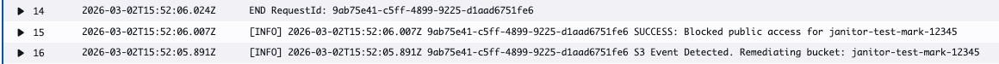

# 🧹 AWS S3 Security Janitor 
### *Automated Event-Driven Remediation & Governance*

---

## 🏗️ Architecture & OODA Loop

```text
[  OBSERVE  ] -> S3:PutBucketPolicy (Public Detection via CloudTrail)
       | 
[  ORIENT   ] -> EventBridge Rule (Pattern Match & JSON Parsing)
       | 
[  DECIDE   ] -> Lambda Logic (Verify Public Status & Region)
       | 
[    ACT    ] -> Boto3:PutBucketPublicAccessBlock (Remediation)
```

The framework follows a reactive security loop:
1. **Detect:** AWS CloudTrail captures a security event.
2. **Filter:** Amazon EventBridge identifies the violation.
3. **Remediate:** AWS Lambda enforces the security baseline.

---

## 🧪 Evidence of Remediation (The "Chaos Test")
### CloudWatch Validation

### 📜 Automated Audit Trail (CloudWatch)

*The "Smoking Gun": This log verifies the Janitor identified the drift and successfully enforced the security policy via PutBucketPublicAccessBlock in near real-time.*

---

## 💎 Engineering Insights
* **Static Backend:** Hardcoded region in `provider.tf` to satisfy Terraform's initialization requirements.
* **Least-Privilege:** Custom IAM policies to prevent automation "over-reach."
* **Secret Scrubbing:** Strict Git-flow to prevent `.env` and `.tfvars` leakage.

---

## 🔧 Technical Stack
* **Infrastructure:** Terraform (HCL)
* **Runtime:** Python 3.13 (Boto3)
* **Governance:** EventBridge & CloudWatch

---

## 🔮 Future Roadmap (Scaling & Retroactivity)
* **Historical Remediation:** Currently, the Janitor is **Event-Driven** to maintain a "Zero-Read" security posture. A future iteration would include an **AWS Config** trigger to perform a one-time "historical sweep" of buckets created before the Janitor was deployed.
* **Multi-Account Orchestration:** Expanding the EventBridge bus to aggregate security events from a multi-account AWS Organization.

---

## 📖 Discussion: NIST 1800 Series (Alignment & Compliance)
An S3 event-driven janitor (using Lambda & EventBridge) falls within several volumes of the NIST SP 1800 series.

While the 800-series (like 800-53) provides the "what" (controls), the 1800-series provides the "how" (architectural implementation). The S3 Event-Driven Security Janitor aligns with the following three major areas:

1. **Data Integrity & Lifecycle (NIST SP 1800-11 & 1800-25/26)**
    > These volumes focus on protecting against data corruption and unauthorized modification.
    >
    > **The Fit:** A "janitor" Lambda is used for automated remediation (e.g., deleting unencrypted objects or moving public objects to private buckets).
    >
    > **NIST Alignment:** Maps to the Protect & Respond functions of the NIST Cybersecurity Framework (CSF). Specifically, SP 1800-11 (Data Integrity).

2. **Trusted Cloud (NIST SP 1800-19)**
    > This guide, *Trusted Cloud: VMware Hybrid Cloud IaaS Environments* (and its cloud-native extensions), addresses how to automate security policies in cloud workloads.
    >
    > **The Fit:** The series emphasizes continuous monitoring and automated policy enforcement.
    >
    > **NIST Alignment:** Using EventBridge to trigger a Lambda janitor is a textbook example of "Policy as Code." It allows you to enforce security boundaries (like geolocation or encryption requirements) the moment an S3 event occurs, rather than waiting for a weekly audit.

3. **Zero Trust Architecture (NIST SP 1800-35)**
    > This is the newest and most relevant guide for modern serverless architectures.
    >
    > **The Fit:** Zero Trust (ZT) relies on the principle of **Continuous Verification**.
    >
    > **NIST Alignment:** In a ZT environment, an S3 bucket isn't just "trusted" because it's inside a VPC. Every action (PutObject) is an event that can be scrutinized. The Lambda janitor acts as a **Policy Decision Point (PDP)** / **Policy Enforcement Point (PEP)** extension by verifying the "health" or "compliance" of the data immediately upon entry.


Upon implementation we aren't just "cleaning up files"—we're fulfilling specific NIST 1800 requirements for automated configuration management and near real-time incident response.
